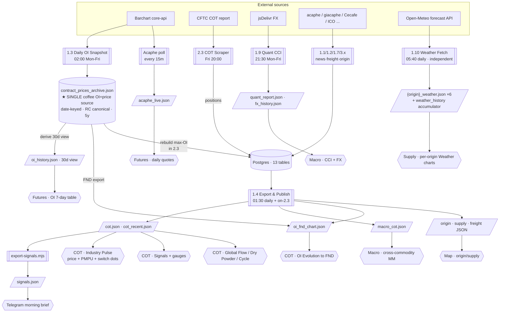
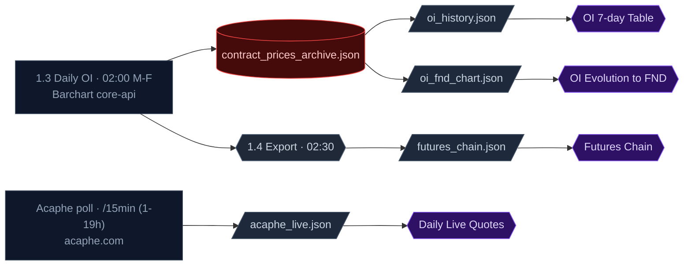
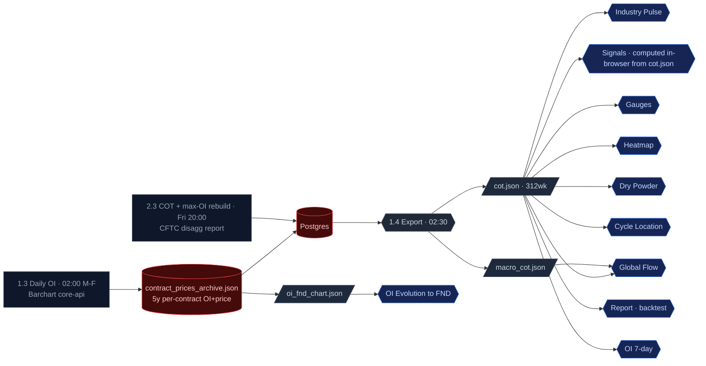
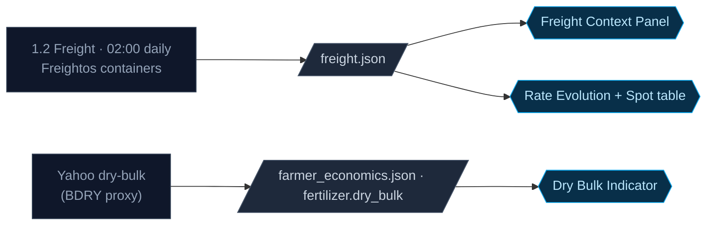
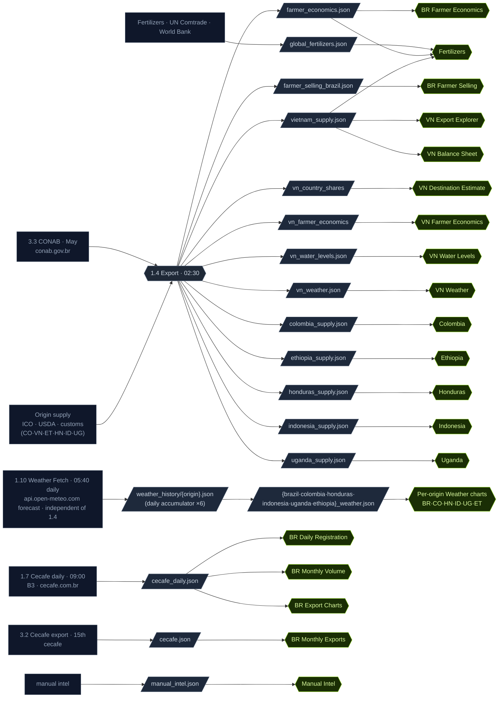
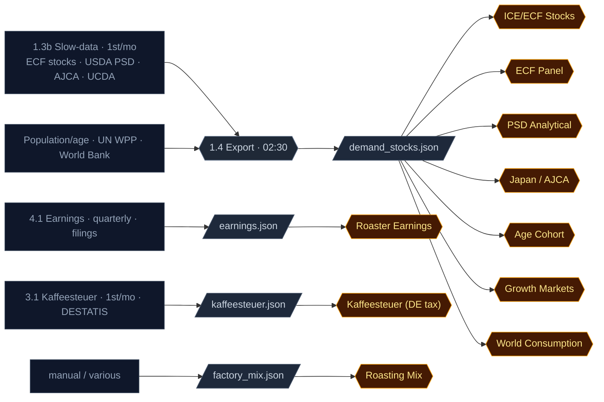
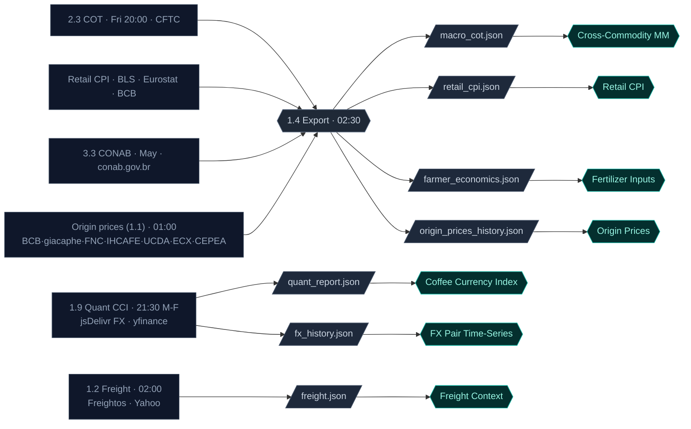
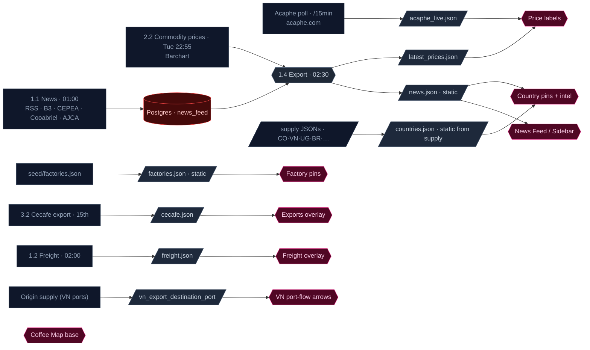
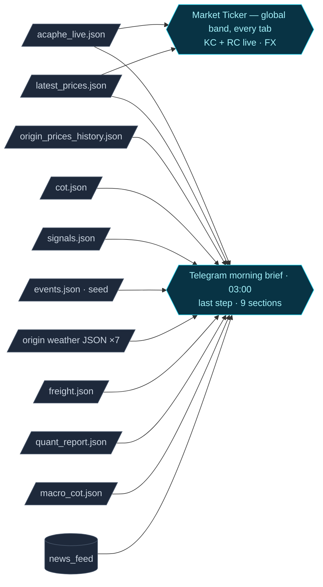

# Coffee Intel Map — Data Platform Map

_Last updated: 2026-05-23 (1.7 now pings the Vercel deploy hook to publish `[skip ci]` data commits)_

## TODO / open items

- [ ] **Add `VERCEL_DEPLOY_HOOK` repo secret** — without it the daily redeploy
      (step in 1.7) no-ops and production stays stale on `[skip ci]` data commits.
      Vercel → Settings → Git → Deploy Hooks → create one on `main`, copy the URL →
      GitHub repo Settings → Secrets and variables → Actions → new secret
      `VERCEL_DEPLOY_HOOK`. _One-time; everything else is already wired._
- [ ] **8-day OI gap (2026-03-26 → 2026-04-05)** — between the bulk OI CSV's end
      (2026-03-25) and the live archive's start (~2026-04-06). Those COT-Tuesdays
      keep their pre-rebuild price. _User to supply the gap OI data; load with
      `load_contract_csv.py --kind oi`._
- [x] **Origin export data for Colombia / Honduras / Indonesia / Ethiopia**
      — DONE (annual). The dead ICO path is replaced by a USDA PSD fallback:
      `psd_coffee` already parses each producer's annual Bean Exports;
      `psd_country_exports.py` reshapes it and each `export_*.py` uses it when
      ICO is absent; the Supply tabs render it via `AnnualExportsPanel`.
      Populates on the next export-and-publish run.
  - [ ] (follow-up) MONTHLY granularity for these four — needs per-country
        national scrapers: FNC xlsx (Colombia), BPS table (Indonesia),
        IHCAFE/INE PDF (Honduras), ECTA/FAS GAIN PDF (Ethiopia).
- [ ] **Stale `acaphe_live.json`** (snapshot ~27 days old) — `/api/live`
      (Upstash) returns 503 so the ticker, map price labels, origin-price diffs
      and the Telegram brief fall back to a stale snapshot. Needs the acaphe
      poller running with its secrets. _Deferred._
- [ ] **Data gaps to backfill** (panels render but a series is empty):
      `demand_stocks.json` → `age_cohort_18plus` (null) and ECF
      `arabica_washed_mt`/`robusta_mt` (null); `retail_cpi.json` → no
      `kc_futures` series; `origin_prices_history.json` → `brazil_arabica`
      history empty; `farmer_economics.json` → `fertilizer.dry_bulk` /
      `import_origins` null. _Deferred — upstream scraper output, not bugs._
- [ ] (someday) Migrate FND chart + frontend `STATIC_SERIES` to RC so the
      DISPLAY=RM conversion can be dropped entirely (cosmetic; low priority).

---

## 1. The architecture in one picture

---

## 2. Fetch layer (scheduled jobs)

| WF | Name | Schedule (UTC) | Fetches | Lands in |
|---|---|---|---|---|
| **1.3** | Daily OI Snapshot | 02:00 Mon-Fri | KC+RM full chain (OI+price) | **`contract_prices_archive.json`** (+ derives `oi_history.json`) |
| 1.1 | Daily News | 01:00 daily | news + origin | DB |
| 1.2 | Freight | 02:00 daily | rates | DB |
| 1.4 | **Export & Publish** | 01:30 daily + on-2.3 | *(reads DB + archive)* | ~17 static JSON + signals |
| 1.5 | Check Scrapers Fresh | 07:00 daily | *(reads health.json)* | Telegram |
| 1.6 | Morning Brief | 03:00 daily | *(reads JSON)* | Telegram |
| 1.7 | Cecafe Daily | 09:00 daily | BR registrations | `cecafe_daily.json` (also pings Vercel deploy hook¹ to publish the day's `[skip ci]` data commits) |
| 1.9 | Quant CCI | 21:30 Mon-Fri | FX + Robusta factors | `quant_report.json`+`fx_history.json` |
| **1.10** | **Weather Fetch & Accumulate** | 05:40 daily | per-origin rain+temp, Open-Meteo **forecast** API (`api.open-meteo.com`); **independent of 1.4** | `weather_history/{origin}.json` (accumulator) → rebuilds `{origin}_weather.json` ×6 |
| Acaphe | Live Quotes Poll | every 15m | live quotes | `acaphe_live.json` |
| 2.2 | Commodity Prices | Tue 22:55 | all-commodity prices | DB `commodity_prices` |
| **2.3** | COT Scraper **+ archive price rebuild** | Fri 20:00 | CFTC COT (all commodities + coffee) → DB; **then rebuild cot_weekly prices from archive (max-OI)** | DB |
| 3.1/3.2/3.3/4.1 | Kaffeesteuer / Cecafe / CONAB / Earnings | monthly+ | tax/exports/costs/earnings | DB / JSON |
| 0.1–0.4 | One-shot backfills | manual | *(archive loads, rebuilds)* | DB / archive |

**Retired:** ~~2.1 Tuesday Coffee Settlement Prices~~ — replaced by the archive rebuild step inside 2.3.

> ¹ All data workflows commit JSON with `[skip ci]`, which Vercel ignores, so production never auto-rebuilds on data. The last daily scraper (1.7, ~09:10 UTC) POSTs the Vercel **deploy hook** once to publish the day's accumulated commits. Requires repo secret `VERCEL_DEPLOY_HOOK` (Vercel → Settings → Git → Deploy Hooks); no-ops if unset.

---

## 3. Storage & retention

| Store | Source | Retention |
|---|---|---|
| **`contract_prices_archive.json`** ★ | 1.3 daily + bulk CSV loads | **5y (1320d), auto-trim** |
| `oi_history.json` | **derived** from archive (30d view) | 30 days |
| `cot_weekly` (DB) | 2.3 positions + archive rebuild (prices) | permanent; prices now overwrite-from-archive |
| `commodity_cot` (DB) | 2.3 (all commodities) | permanent |
| `cot.json` | 1.4 from DB | full history |
| `cot_recent.json` | 1.4 | last 12 weeks |
| `signals.json` | export-signals.mjs | current + 8wk |
| `oi_fnd_chart.json` | 1.4 ← archive | cur+prev yr contracts, −45..0d |
| `backend/seed/weather_history/{origin}.json` ×6 | **1.10** daily append (idempotent) | grows indefinitely — the accumulated daily-actuals record |
| `frontend/public/data/{origin}_weather.json` ×6 | **1.10** (seed climatology + live actuals/forecast) | rebuilt daily |
| `vn_weather.json` | static seed (not fetched) | manual |
| 11 other DB tables / ~30 JSON | various | permanent |

---

## 4. Visual → source (the "what feeds what")

### 4a. Per-workflow → exact dashboard visual

| Workflow | DB/JSON output | Component | Tab · Visual |
|---|---|---|---|
| **1.3 Daily OI** | `oi_history.json` | `OIHistoryTable` | **Futures · OI 7-day table** (+ COT §2) |
| | `oi_fnd_chart.json` | `OIFndChart` | **Futures + COT · OI Evolution to FND** |
| | archive→(2.3 rebuild)→`cot.json` price | `Step4IndustryPulse` | **COT · Industry Pulse — price line + switch dots** |
| **1.1 Daily News** | DB `news_feed` | `/api/news`, map labels | **Map · news labels / table**; Telegram news |
| | DB `country_intel` | `CoffeeMap` popups | **Map · country intel** |
| **1.2 Freight** | `freight.json` | `FreightContextPanel` | **Macro · Freight Context**; Telegram freight |
| **1.4 Export & Publish** | *(all static JSON)* | — | *plumbing — feeds every JSON-backed visual* |
| **1.5 Fresh check** | — | — | *Telegram alert only* |
| **1.6 Morning Brief** | reads `signals.json`,`events.json`,JSON | — | **Telegram brief** (the message itself) |
| **1.7 Cecafe Daily** | `cecafe_daily.json` | `DailyRegistration` | **Supply · Brazil · Daily Registration**; Telegram |
| **1.9 Quant CCI** | `quant_report.json` | `CurrencyIndexSection` | **Macro · Coffee Currency Index** |
| | `fx_history.json` | `FxTimeSeriesPanel` | **Macro · FX Pair Time-Series** |
| **1.10 Weather Fetch** | `{origin}_weather.json` ×6 | `WeatherCharts` | **Supply · each origin · Weather charts** — monthly rain, cumulative YTD, mean temp, daily MTD accumulation, 7-day forecast (replaced the legacy drought/frost strip panels) |
| **Acaphe poll** | `acaphe_live.json` | `AcapheLiveQuotes` | **Futures · Daily Live Quotes** |
| **1.3b Slow-Data** (ECF·PSD·AJCA·UCDA) | `demand_stocks.json` | `StocksPanel` | **Demand · Stocks (ICE certified + PSD)** |
| **2.2 Commodity Prices** | DB `commodity_prices` → `latest_prices.json` | `CoffeeMap` | **Map · price labels + header ticker** |
| **2.3 COT Scraper + rebuild** | `cot.json` | `Step1/4/5/6/7/8` | **COT · Signals, Gauges, Heatmap, Global Flow, Industry Pulse (positions), Dry Powder, Cycle, Report** |
| | `macro_cot.json` | `CrossCommodityPanel` | **Macro · Cross-Commodity MM** |
| | `signals.json` | morning_brief | **Telegram · CoT signals** |
| | archive rebuild → `cot.json` price | `Step4IndustryPulse` | **COT · Industry Pulse price (true max-OI)** |
| **3.1 Kaffeesteuer** | `kaffeesteuer.json` | `KaffeesteuerChart` | **Demand · Kaffeesteuer (DE tax)** |
| **3.2 Cecafe Export** | `cecafe.json` | `CoffeeMap` | **Map · Brazil monthly exports** |
| **3.3 CONAB** | `farmer_economics.json` | `FertilizerInputsPanel` / `FarmerSellingPanel` | **Macro · Fertilizer Inputs** + **Supply · Farmer Economics** |
| **4.1 Earnings** | `earnings.json` | `EarningsTable` | **Demand · Roaster Earnings** |
| _various / manual_ | `factory_mix.json` | `RoastingMixPanel` | **Demand · Roasting Mix** |
| | `global_fertilizers.json` | `FertilizersTab` | **Supply · Fertilizers** |
| | `manual_intel.json` | `ManualIntelPanel` | **Supply · Manual Intel** |
| | `retail_cpi.json` | `RetailCpiPanel` | **Macro · Retail CPI** |
| | `origin_prices_history.json` | `OriginPricesPanel` | **Macro · Origin Prices** |
| | `farmer_selling_brazil.json` | `FarmerSellingPanel` | **Supply · Farmer Selling** |
| | `*_supply.json` (colombia/vietnam/…) | per-country tabs | **Supply · country pages**; **Map** |

### 4c. By dashboard tab (one diagram per tab)

Source · frequency → store → JSON → visual, scoped to each tab. Replaces the earlier single mega diagram.

#### Futures Exchange

#### COT

#### Freight

#### Supply

#### Demand

#### Macro

#### News & Intel (Map)

#### Global — Ticker & Telegram brief

### 4b. By dashboard tab (reverse view)

- **COT** (`/cot`): Industry Pulse, Signals (computed in-browser from `cot.json`), Gauges, Heatmap, Global Flow (`macro_cot.json`), Dry Powder, Cycle, Report ← `cot.json`; OI 7-day ← `oi_history.json`, OI→FND ← `oi_fnd_chart.json`. (`signals.json` feeds only the Telegram brief.)
- **Futures** (`/futures`): daily quotes ← `acaphe_live.json`; chain ← `futures_chain.json`; OI table ← `oi_history.json`; OI→FND ← `oi_fnd_chart.json`.
- **Macro** (`/macro`): CCI ← `quant_report.json`; FX ← `fx_history.json`; cross-commodity MM ← `macro_cot.json`; freight ← `freight.json`; retail CPI ← `retail_cpi.json`; fertilizer inputs/origin prices ← `farmer_economics.json`/`origin_prices_history.json`.
- **Demand** (`/demand`): stocks ← `demand_stocks.json`; roasting mix ← `factory_mix.json`; earnings ← `earnings.json`; DE tax ← `kaffeesteuer.json`.
- **Supply** (`/supply`): Brazil daily reg ← `cecafe_daily.json`; fertilizers ← `global_fertilizers.json`; farmer economics ← `farmer_*`; manual intel ← `manual_intel.json`; country pages ← `*_supply.json`.
- **Map** (`/map`): price labels ← `latest_prices.json`; exports ← `cecafe.json`; intel/news ← `/api/news`+`country_intel`.

---

## 5. Key design properties (post-redesign)

- **One coffee data source.** All coffee OI + price flows from the single daily
  fetch (1.3) into the archive. The OI table, FND chart, Industry Pulse price,
  and switch markers all derive from it. No parallel Tuesday fetch, no
  Stooq/yfinance continuous-feed exposure.
- **Symbol convention, one layer** (`backend/scraper/symbols.py`):
  FETCH=RM (Barchart) · STORE=RC (canonical) · DISPLAY=RM (OI table + FND chart).
- **Price/label can't disagree.** Both come from the same archive cell, chosen
  by max-OI per COT-Tuesday.
- **Single DB→JSON sync point**: the export job (1.4). No-op commits are skipped.
- **Reversibility**: every price rebuild archives originals to
  `cot_weekly_price_archive`.
