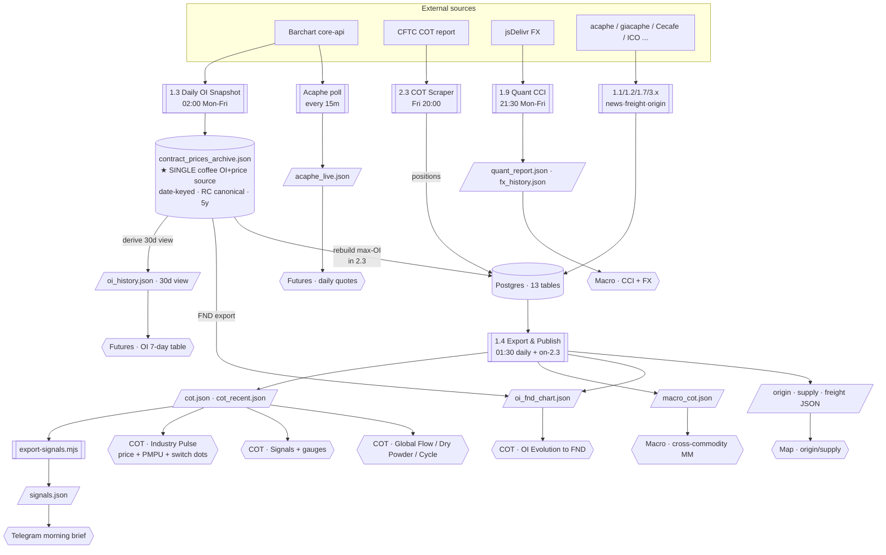

# Coffee Intel Map — Data Platform Map

_Last updated: 2026-05-20 (post archive-unification + true max-OI rebuild)_

## TODO / open items

- [ ] **8-day OI gap (2026-03-26 → 2026-04-05)** — between the bulk OI CSV's end
      (2026-03-25) and the live archive's start (~2026-04-06). Those COT-Tuesdays
      keep their pre-rebuild price. _User to supply the gap OI data; load with
      `load_contract_csv.py --kind oi`._
- [ ] (someday) Migrate FND chart + frontend `STATIC_SERIES` to RC so the
      DISPLAY=RM conversion can be dropped entirely (cosmetic; low priority).

---

## 1. The architecture in one picture

---

## 2. Fetch layer (scheduled jobs)

| WF | Name | Schedule (UTC) | Fetches | Lands in |
|---|---|---|---|---|
| **1.3** | Daily OI Snapshot | 02:00 Mon-Fri | KC+RM full chain (OI+price) | **`contract_prices_archive.json`** (+ derives `oi_history.json`) |
| 1.1 | Daily News | 01:00 daily | news + origin | DB |
| 1.2 | Freight | 02:00 daily | rates | DB |
| 1.4 | **Export & Publish** | 01:30 daily + on-2.3 | *(reads DB + archive)* | ~17 static JSON + signals |
| 1.5 | Check Scrapers Fresh | 07:00 daily | *(reads health.json)* | Telegram |
| 1.6 | Morning Brief | 03:00 daily | *(reads JSON)* | Telegram |
| 1.7 | Cecafe Daily | 09:00 daily | BR registrations | `cecafe_daily.json` |
| 1.9 | Quant CCI | 21:30 Mon-Fri | FX + Robusta factors | `quant_report.json`+`fx_history.json` |
| Acaphe | Live Quotes Poll | every 15m | live quotes | `acaphe_live.json` |
| 2.2 | Commodity Prices | Tue 22:55 | all-commodity prices | DB `commodity_prices` |
| **2.3** | COT Scraper **+ archive price rebuild** | Fri 20:00 | CFTC COT (all commodities + coffee) → DB; **then rebuild cot_weekly prices from archive (max-OI)** | DB |
| 3.1/3.2/3.3/4.1 | Kaffeesteuer / Cecafe / CONAB / Earnings | monthly+ | tax/exports/costs/earnings | DB / JSON |
| 0.1–0.4 | One-shot backfills | manual | *(archive loads, rebuilds)* | DB / archive |

**Retired:** ~~2.1 Tuesday Coffee Settlement Prices~~ — replaced by the archive rebuild step inside 2.3.

---

## 3. Storage & retention

| Store | Source | Retention |
|---|---|---|
| **`contract_prices_archive.json`** ★ | 1.3 daily + bulk CSV loads | **5y (1320d), auto-trim** |
| `oi_history.json` | **derived** from archive (30d view) | 30 days |
| `cot_weekly` (DB) | 2.3 positions + archive rebuild (prices) | permanent; prices now overwrite-from-archive |
| `commodity_cot` (DB) | 2.3 (all commodities) | permanent |
| `cot.json` | 1.4 from DB | full history |
| `cot_recent.json` | 1.4 | last 12 weeks |
| `signals.json` | export-signals.mjs | current + 8wk |
| `oi_fnd_chart.json` | 1.4 ← archive | cur+prev yr contracts, −45..0d |
| 11 other DB tables / ~30 JSON | various | permanent |

---

## 4. Visual → source (the "what feeds what")

| Visual | Source | Ultimately from |
|---|---|---|
| **COT · Industry Pulse** (price, PMPU, switch dots) | `cot.json` | archive (price, max-OI) + DB (positions) |
| COT · Signals / gauges / heatmap | `cot.json` → signalEngine | DB positions + archive price |
| COT · Global Flow / Dry Powder / Cycle | `cot.json` + `macro_cot.json` | DB |
| **COT · OI Evolution to FND** | `oi_fnd_chart.json` | **archive** |
| Futures · OI 7-day table | `oi_history.json` | **archive (30d view)** |
| Futures · daily quotes | `acaphe_live.json` | acaphe poll |
| Macro · cross-commodity MM | `macro_cot.json` | DB `commodity_cot` (2.3) |
| Macro · CCI + FX | `quant_report.json`+`fx_history.json` | 1.9 |
| Macro · Retail CPI / Fertilizers | `retail_cpi.json`/`global_fertilizers.json` | scrapers |
| Map · factories / origin / supply | `factories.json` + `*_supply.json` | DB + scrapers |
| Telegram brief | `signals.json` + `events.json` + JSON | archive + DB |

---

## 5. Key design properties (post-redesign)

- **One coffee data source.** All coffee OI + price flows from the single daily
  fetch (1.3) into the archive. The OI table, FND chart, Industry Pulse price,
  and switch markers all derive from it. No parallel Tuesday fetch, no
  Stooq/yfinance continuous-feed exposure.
- **Symbol convention, one layer** (`backend/scraper/symbols.py`):
  FETCH=RM (Barchart) · STORE=RC (canonical) · DISPLAY=RM (OI table + FND chart).
- **Price/label can't disagree.** Both come from the same archive cell, chosen
  by max-OI per COT-Tuesday.
- **Single DB→JSON sync point**: the export job (1.4). No-op commits are skipped.
- **Reversibility**: every price rebuild archives originals to
  `cot_weekly_price_archive`.
